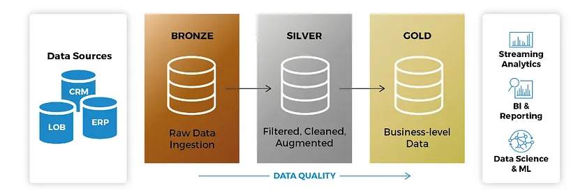

# Deploy medallion architecture

The aim of gradually and progressively enhancing the structure and quality of data as it flows through each layer of the architecture (from Bronze → Silver → Gold layer tables), a Medallion Architecture is a data design pattern used to logically organise data in a lakehouse.

### Bronze layer (raw data)
This phase marks the entry of raw data, which is stored as it is collected, typically from various sources and in formats such as CSV or JSON.

### Silver layer (cleansed and conformed data)
At this stage we give a “Enterprise view” of all of its important business entities, concepts, and transactions, the data from the Bronze layer.
The data is processed and transformed to achieve cleaner and structured data. Tasks such as filtering, validation, and data normalization are carried out, and the data is stored in efficient formats.

### Gold layer (curated business-level tables)
The Lakehouse’s Gold layer data is usually arranged in “project-specific” databases that are ready for consumption. With fewer joins and more read-optimized and de-normalized data models, the Gold layer is used for reporting.

 

In this project we using Terraform to deploy medallion architecture, with data pipelines.

The core technologies featured in this project are **Azure Databricks, Azure Data Fabric and Terraform**, all hosted on the Azure Cloud.

 

## Context

 Deloyment of medallion architecture using [Infrastructure as Code (IaC)](https://www.redhat.com/en/topics/automation/what-is-infrastructure-as-code-iac).

  

## Content

#### [Install and configuration](./assets/documentation/install-configuration/README.md)
#### 

 

## Versions

| Name      | version |
|-----------|-------|
| Terraform | 1.7.3 |
| Apache Spark | 9.1.x-scala2.12 |
| Azure SQL Server | 12.0 |
| databricks/databricks | 1.36.3 |
| hashicorp/azurerm | 3.91.0 |

