## Install and configuration - Deploy Resource Group with Terraform

### Prerequisites

**Terraform**: Requires, [clic here to know how to install in your OS](https://phoenixnap.com/kb/how-to-install-terraform)

**Azure Cloud**: Create an free or payment account, [clic here to follow instruction of a free subscripcion](https://k21academy.com/microsoft-azure/create-free-microsoft-azure-trial-account/)

<br>
<hr>

### Install and configuration diagram

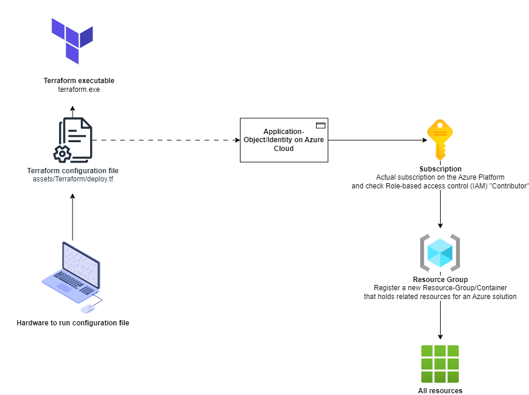

<br>
<hr>

### **Step 1**: Create an Application Object in Azure

<br>

> In this step we create an Application-Object/Identity, instead of using a root account, for security reasons.

<br>

**1.1.** Login.

**1.2.** Enter into [Application registrations](https://portal.azure.com/?quickstart=true#view/Microsoft_AAD_RegisteredApps/ApplicationsListBlade) in Azure or search it.

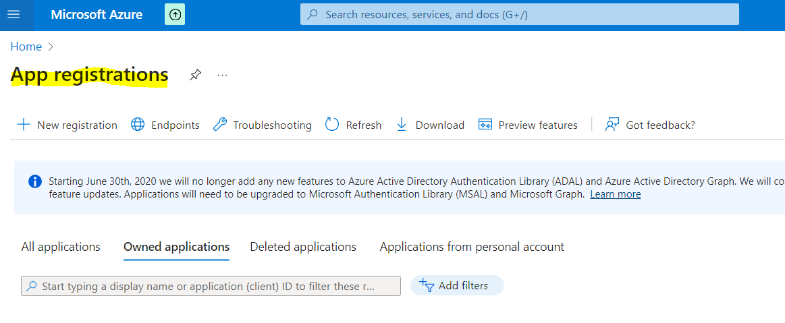

**1.3.** Clic on "New Registration", and complete the registration fields.

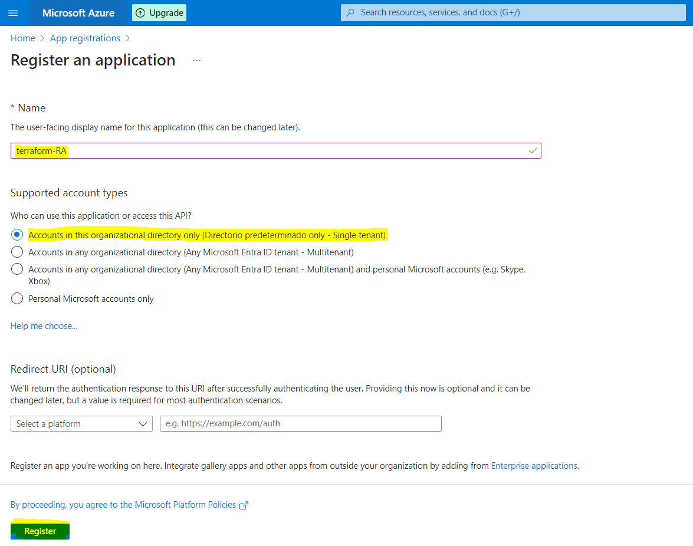

**1.4.** Now we are defined a new identity that can be used in the Terraform configuration file.

<br>

<hr>

### **Step 2**: Configure Terraform file, to connect into our Azure Cloud

<br>

> Now we configure the Terraform configuration file: "[deploy.tf](../../Terraform/deploy.tf)"

<br>

**2.1.** Now we gonna change the [assets/Terraform/deploy.tf](../../Terraform/deploy.tf), please replace with your information, for that follow the next steps:


```JSON
terraform {
  required_providers {
    azurerm = {
      source = "hashicorp/azurerm"
      version = "3.91.0"
    }
  }
}

provider "azurerm" {
  # Configuration options
  subscription_id = "<Your_Subscription ID>"
  client_id = "<Your_Application(Client) ID>"
  client_secret = "<Your_Client Secret>"
  tenant_id = "<Your_Tenant ID>"
  features {
    
  }
}
```

First we fill the "client_id" and "tenant_id", from the last Application Registrations we create in the 'Step 1: Create an Application Object in Azure'.

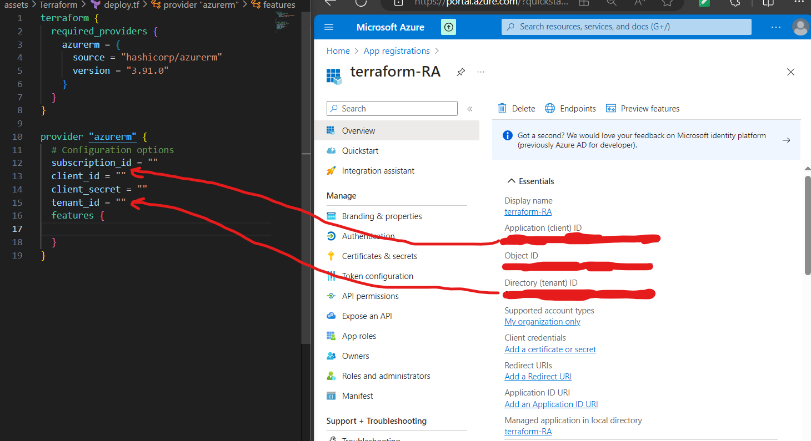

<br>

We continue filling the "client_secret", going to 'Add a certificate or secret'-> next we clic on 'New client secret'-> add, and then we copy a 'Value' to "client_secret".

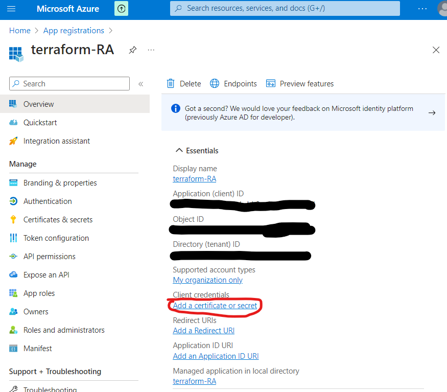

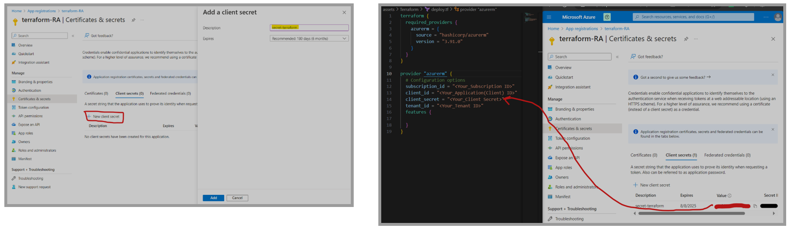

<br>

And to fill the last field "subscription_id", go to 'Subscription' or search it, and copy your 'Subscription ID'.

> Please remember that this is a project porpuse, in production environment you should manage this sensible data with a secret manager or a system that allows manage secrets.

<br>

**2.2.** Set contributor role to an Application-Object/Identity that we create, to create resources.

For that we go to 'Subscription', then go to 'Access Control (IAM)'.

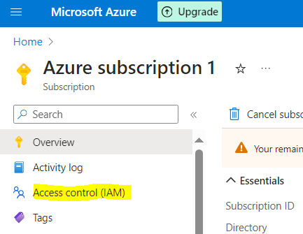

Add new 'role assignment':

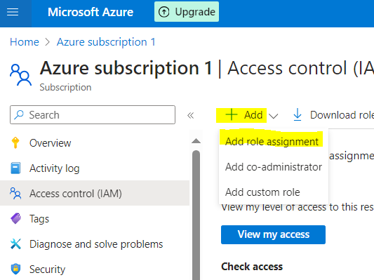

Add Application-Object/Identity that we create "terraform-RA" as member of 'Contributor' role in our Azure Cloud.

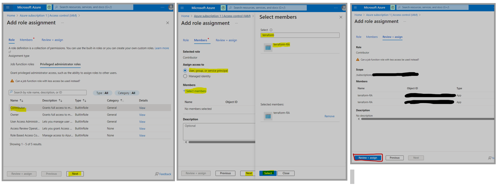

Clic on 'Review + assign'.


<br>

<hr>

### **Step 3**: Configure Terraform file, create a resource group in Azure Cloud

<br>

**3.1.** Put your location, or leave the default value.

```JSON
...
# Create a resource group:
resource "azurerm_resource_group" "medallion-RG" {
  name = "medallion-spark-dbt-RG"
  location = "West Europe" # Exmpl; West Europe, North Europe, ...
}

```

<br>

<hr>

### **Step 4**: Set up Terraform

<br>

**4.1.** Terraform initialization, inside of "assets/Terraform/" directory

```cmd
az login
```

```bash
terraform init
```

>  Note that create two files and one folder.

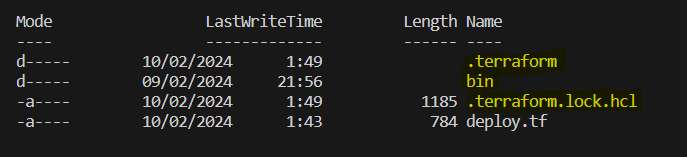


<br>

**4.2.** Create a plan from the configuration we put inside in [assets/Terraform/deploy.tf](../../../assets/Terraform/deploy.tf)

```bash
terraform plan -out deploy.tfplan
```

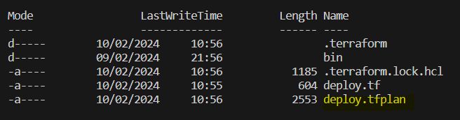

**4.3.** Finally we apply the plan [assets/Terraform/deploy.tfplan](../../../assets/Terraform/deploy.tfplan)

```bash
terraform apply deploy.tfplan
```

<br>

**Once it finish, this will happen...:**

- Now we have in our Azure Platform, a **new Resource group "medallion-spark-dbt-RG"**:

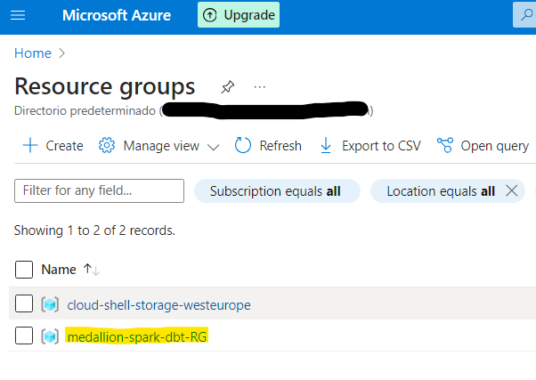

- A **new storage account "medallionsa"**: 

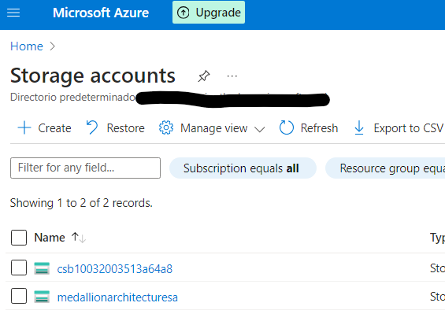

- A **three new containers** into the storage account:

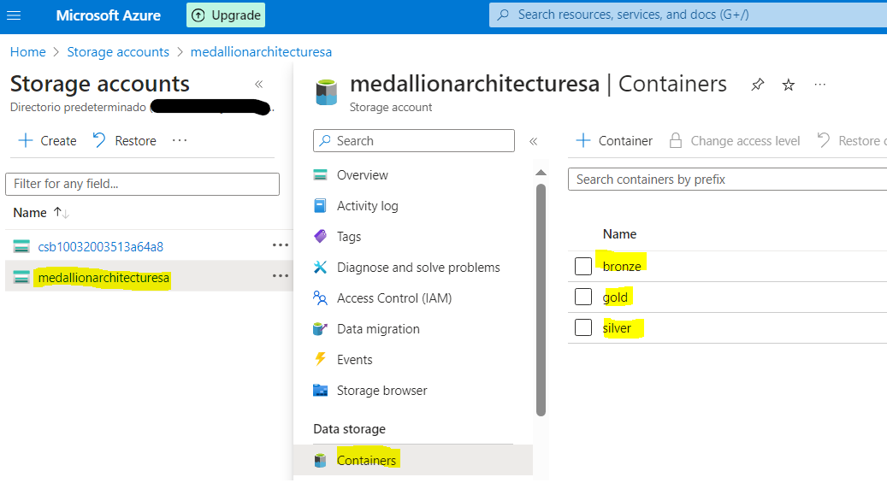

- A **new key vault**:

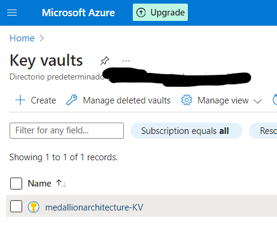

<br>
<hr>
<br>